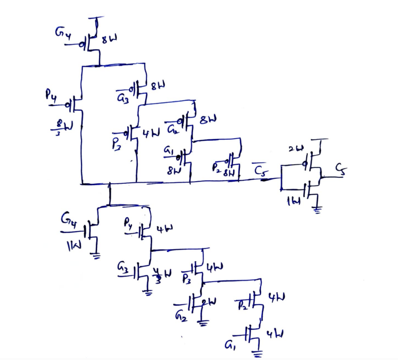

# 5-Bit Carry Look-Ahead Adder (CLA)

### Full-Custom VLSI Implementation using Static CMOS and Transmission Gate Logic

  

  <em>
  Custom CMOS implementation of the C5 carry equation showing non-uniform transistor sizing to compensate for varying stack depths and maintain balanced drive strength.
  </em>

---

## Project Overview

This project presents the design and implementation of a **5-bit Carry Look-Ahead Adder (CLA)** using a hybrid transistor-level design methodology:

* Static CMOS logic for all combinational blocks
* Transmission-Gate based Master-Slave D Flip-Flops for pipelining
* Custom transistor sizing based on equivalent resistance matching
* Full custom layout implementation in 180nm CMOS technology
* Pre-layout and Post-layout verification
* Verilog HDL modeling and FPGA validation

Unlike a conventional CLA built using cascaded logic gates, the carry equations in this project are directly mapped into optimized CMOS pull-up and pull-down transistor networks, reducing logic depth and improving performance.

---

# Custom Carry Logic Design

A major novelty of this project is the direct transistor-level implementation of carry equations.

For example:

C5 = G4 + P4G3 + P4P3G2 + P4P3P2G1

Instead of implementing this equation using multiple AND and OR gates, the equation is directly realized using custom CMOS pull-up and pull-down networks.

To compensate for the increased resistance caused by deeper transistor stacks, different transistor widths are used throughout the network.

This sizing strategy ensures that:

* Pull-up resistance remains balanced
* Pull-down resistance remains balanced
* Rise and fall delays remain comparable
* Delay is minimized across different signal paths

The figure above shows the transistor-level realization of the C5 carry equation with optimized sizing.

---

# Architecture

The design consists of:

## Input Register Stage

Input operands A[4:0] and B[4:0] are synchronized using Transmission-Gate based D Flip-Flops.

## Propagate and Generate Logic

For each bit:

P = A ⊕ B

G = A · B

These signals are generated using static CMOS XOR and AND gates.

## Carry Look-Ahead Network

Carry signals are generated in parallel using:

C2 = G1

C3 = G2 + P2G1

C4 = G3 + P3G2 + P3P2G1

C5 = G4 + P4G3 + P4P3G2 + P4P3P2G1

C6 = G5 + P5G4 + P5P4G3 + P5P4P3G2 + P5P4P3P2G1

The carry network is implemented directly at transistor level.

## Sum Generation

Sum outputs are computed using:

Si = Pi ⊕ Ci

## Output Register Stage

Results are captured using Transmission-Gate based D Flip-Flops.

---

# Why Static CMOS for Carry Logic?

## Reduced Logic Depth

Traditional CLA implementations require:

AND → OR → OR

logic chains.

Direct CMOS realization reduces the number of logic stages.

Benefits:

* Lower propagation delay
* Faster carry computation
* Smaller critical path

---

## Fewer Internal Nodes

Gate-level implementations introduce many intermediate nodes.

These nodes:

* Add capacitance
* Increase dynamic power
* Increase delay

Direct transistor implementation eliminates many of these nodes.

Benefits:

* Reduced switching activity
* Lower power consumption
* Faster operation

---

## Full Voltage Swing

Static CMOS provides:

* Strong logic 0
* Strong logic 1
* Rail-to-rail outputs

Benefits:

* High noise immunity
* Improved robustness

---

## Zero Static Power

In steady state:

* Pull-up network OFF or
* Pull-down network OFF

No direct path exists between VDD and GND.

Benefits:

* Near-zero static power consumption

---

## Better Physical Optimization

Since carry equations are implemented directly:

* Logic structure can be optimized
* Routing can be minimized
* Area can be reduced

compared to gate-based implementations.

---

# Why Transmission Gate Flip-Flops?

The storage elements are implemented using Master-Slave Transmission-Gate D Flip-Flops.

---

## Lower Transistor Count

Transmission gates replace larger CMOS multiplexing structures.

Benefits:

* Reduced area
* Simpler layout

---

## Full Swing Operation

A transmission gate combines:

* NMOS
* PMOS

allowing:

* Strong 0 transmission
* Strong 1 transmission

without threshold voltage degradation.

---

## Faster Data Transfer

Transmission gates provide low-resistance paths.

Benefits:

* Lower setup time
* Reduced clock-to-Q delay

---

## Lower Clock Loading

Compared to conventional flip-flops:

* Fewer clock-controlled transistors
* Smaller clock capacitance

Benefits:

* Lower clock power
* Better scalability

---

## Weak Feedback Keeper Strategy

The design uses:

* Strong forward path
* Weak feedback inverter

This allows new data to overwrite old data quickly while still retaining state reliably.

Benefits:

* Faster transitions
* Reduced contention current
* Reliable storage

---

# Transistor Sizing Methodology

Technology:

* 180nm CMOS
* λ = 0.09 μm

Reference inverter:

* Wn = 10λ
* Wp = 20λ
* L = 2λ

Transistor widths throughout the design were selected such that the effective pull-up and pull-down resistance approximately matches the reference inverter.

Benefits:

* Balanced rise/fall delays
* Improved timing predictability
* Better signal integrity

---

# Verification Flow

The design was verified through:

1. Transistor-Level Schematic Design
2. NGSpice Functional Simulation
3. Timing Characterization
4. Custom Layout Design in Magic
5. Parasitic Extraction
6. Post-Layout Simulation
7. Verilog HDL Modeling
8. GTKWave Verification
9. Vivado Simulation
10. FPGA Hardware Validation

---

# Performance Results

## Pre-Layout Results

| Parameter         | Value    |
| ----------------- | -------- |
| Setup Time        | 100 ps   |
| Hold Time         | 44 ps    |
| Clock-to-Q Delay  | 0.2 ns   |
| Adder Delay       | 0.64 ns  |
| Maximum Frequency | 1.06 GHz |

---

## Post-Layout Results

| Parameter         | Value   |
| ----------------- | ------- |
| Setup Time        | 89 ps   |
| Hold Time         | 38 ps   |
| Clock-to-Q Delay  | 0.26 ns |
| Adder Delay       | 1.44 ns |
| Maximum Frequency | 559 MHz |

---

# Comparison with Conventional CLA

| Feature                | Conventional CLA | This Work            |
| ---------------------- | ---------------- | -------------------- |
| Carry Logic            | AND/OR Gates     | Direct CMOS Network  |
| Logic Depth            | Higher           | Lower                |
| Internal Nodes         | More             | Fewer                |
| Dynamic Power          | Higher           | Lower                |
| Noise Margin           | Moderate         | High                 |
| Flip-Flops             | Standard CMOS FF | Transmission-Gate FF |
| Clock Loading          | Higher           | Lower                |
| Layout Optimization    | Limited          | Full Custom          |
| Post-Layout Validation | Often Omitted    | Included             |
| FPGA Validation        | Optional         | Included             |

---

# Tools Used

* NGSpice
* Magic VLSI
* Verilog HDL
* GTKWave
* Vivado
* FPGA Development Board

---

# Key Contributions

✔ Full custom transistor-level CLA implementation

✔ Direct CMOS realization of carry equations

✔ Stack-aware transistor sizing methodology

✔ Transmission-Gate based D Flip-Flops

✔ Complete layout generation and extraction

✔ Timing verification with parasitics

✔ FPGA hardware validation

---

# Conclusion

A high-speed 5-bit Carry Look-Ahead Adder was successfully designed, implemented, and verified using a hybrid Static CMOS and Transmission-Gate design methodology.

By directly implementing carry equations as optimized transistor networks and employing carefully sized Transmission-Gate flip-flops, the design achieves lower logic depth, improved timing performance, strong noise immunity, and efficient full-custom VLSI realization from schematic design to FPGA validation.
